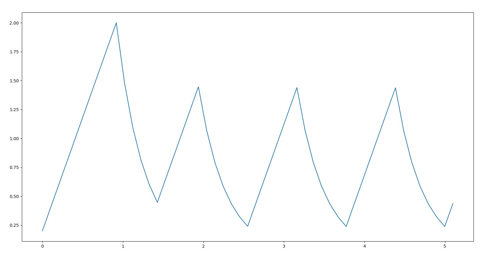

# Creating Controllers

> Replace this text and below.

Filesystem finally must be of the form:

```bash
README.md
capacitor_voltage_control
    |_ Some files inside this, include the .cpp and the graph generated
simplified_inverted_pendulum_control
    |_ Include .slx file, and graph generated by the scope
uav_elevation_control
    |_ Include .slx file, and graph generated by the scope
```

## Approach to Control Design

> Replace this text and below.

Mathematical modelling, understanding Transfer functions, need for controller. Explain all these and more here.
This must be done by Pulak, Monkesh, Shivam and Devesh together.

Make seperate folders for each problem statements, each folder name must match with the following topic names.

---

## Problem Statements

### Capacitor Voltage Control

Problem : 
Write a code to maintain a specific potential difference across a Capacitor.

The potential difference drops across the capacitor exponentially.
We can increase the potential difference linearly only to maintain the specific value.

Once the potential difference starts increasing or decreasing, it cannot stop until a specific time,
even if it crosses the required limit.

Approach :
We keep the track of a time variable to check the status of our capacitor at each time interval.
We also see if the time limit(for which the capacitor can not shift between charging and discharging state)
if reached or not.

Then we write the code for two cases -
1) When the voltage difference is less than the required value, and we need to charge the capacitor.
2) When the voltage difference is more than the required valuen and we need to discharge the capacitor.

Output graph : 

The following graph was plotted using Python.

<!-- 
> Replace this text and below.

Explanation of what you did goes here, include the capacitor control problem statement here, explaining both
the problem and how you approached it. This should be done by **Monkesh**. -->

### Simplified Inverted Pendulum Control

> Replace this text and below.

Explanation of what you did goes here, include the Problem statement of Inverted Pendulum here, explaining both
the problem and how you approached it. This should be done by **Pulak**.

### UAV Elevation Control

> Replace this text and below.

Explanation of what you did goes here, include the Problem statement of Elevation Control here, explaining both the
problem and how you approached it. This should be done by **Shivam**.
