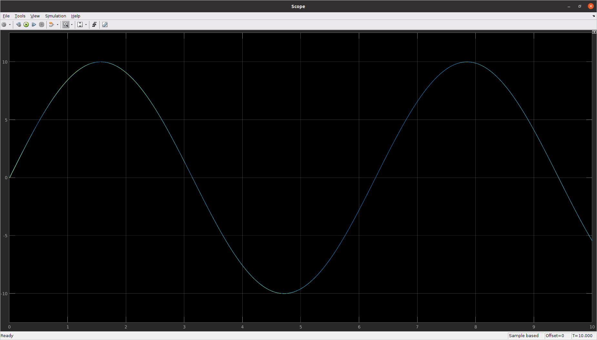

# Creating Controllers

> Replace this text and below.

Filesystem finally must be of the form:

```bash
README.md
capacitor_voltage_control
    |_ Some files inside this, include the .cpp and the graph generated
simplified_inverted_pendulum_control
    |_ Include .slx file, and graph generated by the scope
uav_elevation_control
    |_ Include .slx file, and graph generated by the scope
```

## Approach to Control Design

In any system/plant, to maintain a certain target reference level we need a controller to feed necessary input into the actuator. Controllers work on a feedback loop which measures the deviation of true output with the expected output, and tries to maintain true output level close to the reference output level. The most common type of controller is the PID (Proportional-Derivative_Integral) controller. Transfer functions are functions typically in Laplace domain which relate input to output in a plant. They are representative of nature of a physical system.

---

## Problem Statements

### Capacitor Voltage Control

> Problem Statement:

Write a code to maintain a specific potential difference across a Capacitor.

> Approch:

The potential difference drops across the capacitor exponentially. We can increase the potential difference linearly only to maintain the specific value.

Once the potential difference starts increasing or decreasing, it cannot stop until a specific time, even if it crosses the required limit.

Approach : We keep the track of a time variable to check the status of our capacitor at each time interval. We also see if the time limit(for which the capacitor can not shift between charging and discharging state) if reached or not.

Then we write the code for two cases -

 1) When the voltage difference is less than the required value, and we need to charge the capacitor.
 2) When the voltage difference is more than the required valuen and we need to discharge the capacitor.

### Simplified Inverted Pendulum Control

> Problem Statement:

To derive transfer function of a simplified model of an Inverted Pendulum, and implement a block diagram of the same in Simulink. In an Inverted Pendulum, the goal is to maintain the pendulum at a certain position, which is often an unstable equilibrium. To keep the pendulum stable at the position, we must implement a controller which modulates the current input according to our needs.

> Aprroch:

We formulated a mathematical model to represent the dynamics of the Inverted Pendulum. Using this model, we derived the differential equation and subsequently the transfer function.
τ(s) = 1/(s^2 + k)
where k is a constant depending on the mass, length and torque constant of the motor

### UAV Elevation Control
>Problem Statement:

In the UAV Elevation Control Problem, we want the drone will adject its hight according to sinusoidal input (sin(wt)).we will be providing hight as a sinusoidal function and the drone will continuously changing its height according to the input. we will considaring only 1 D motion (upward and downward) of drone.

>Approch:

we will be considering the total upward trust(of 4 rotors) as linear function of input current to the motor. A transfer function is made which takes current( given to motors) and transfer it to a height( which can be achievied by applying the same curreny to motors in physical drone). A PID feedback control system is implemented which take height of drone as input (with the help of sensors installed in drone) and compare it with the refrance height at that time and give a output current which will be transformed into height through transfer function and again the PID will campare it with the referance value.
After building the setup,PID control loop wil be tune with diffrent values of P,I,D Gains.
for the given set of values( mass etc), the obtained PID values are-
P : 1200
I : 6200
D : 800

>here is the graph genrated in simulink.


